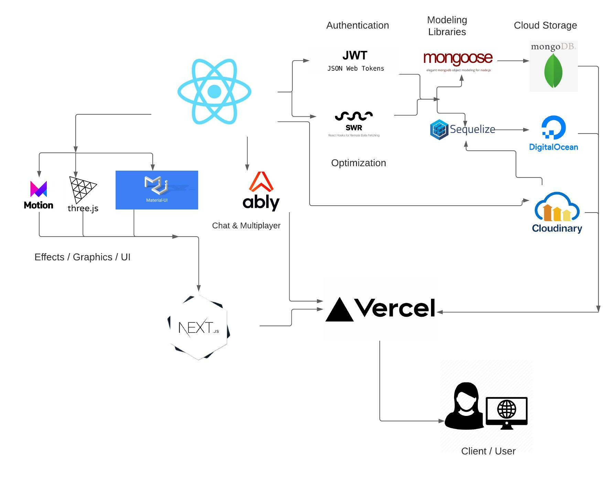

# Beer Bulletin

[](https://opensource.org/licenses/MIT)

Your one stop shop to trade local beers to get the brews you love. Looking to sell your new micro-brew? Post a listing! Looking for that rare beer that's missing in your collection, someone might just have what you're after! Join Beer Bulletin and get started today.

Deployed app at: [beer-bulletin-iota.vercel.app/](https://beer-bulletin-iota.vercel.app/)

## Installation

In the directory and CLI of your choice run

```
git clone git@github.com:sxtnkyl/beer-bulletin.git
```

Create a .env file with the same key/value pairs as in .envEXAMPLE
You will need:

- - aMySQL DB for user/trade/offer data
- - a MongoDB for chat history data
- - an Ably account for Live Chat and Multiplayer features
- - a Cloudinary account for storing user and trade images

## Features

- Login features with profile pic upload feature via Cloudinary and JWT token authentication
- Ability to Make/Post trades and make offers on other people's trades
- Chat live via Ably with users who ave made offers on your trade or vice versa
- play a game of 3d Beer Pong with your chat partner to break the ice (game made with Three.js and Ammo.js)
- user/trade/offer data saved in DigitalOcean MySQL DB
- chat history saved in MongoDB Atlas
- deployed serverlessly on Vercel

## Package/Library flowchart



## Contact Us

[Kyle Sexton](https://github.com/sxtnkyl)

[Bob Perez](https://github.com/perez-rob)

[Austin Huffman](https://github.com/Ahuffma2)
